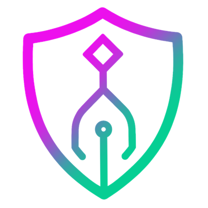

<p align="center">
  
</p>

# dsh-archon

**Archon inside the DeepSeek Harness.** This plugin turns the DSH web UI into a
visual layer for [coleam00/Archon](https://github.com/coleam00/Archon), the
governed agentic-automation engine, so you can launch, watch, approve, and chat
with Archon workflows without leaving the harness. The DSH model gets the same
powers through five `archon_*` tools.

## Introduction

### Why

Archon runs YAML-defined DAG workflows that mix deterministic steps, AI coding
agents (Claude Code, Codex, Pi, OpenCode, Copilot), human approval gates, and
loops. Each run executes in its own git worktree and can be dispatched from the
CLI, Archon's own web UI, Slack, Telegram, GitHub, Discord, or Gitea/GitLab.
Archon's web UI is explicitly a reference implementation over public REST and
SSE contracts, and the project invites third-party front ends.

If DSH is already your daily workbench, a second browser tab with a second login
is friction. This plugin puts Archon's console, chat, run controls, and settings
in the DSH window you already have open, behind DSH's own authentication, and
lets the DSH agent drive Archon from ordinary conversation.

### How

The plugin is a standard external DSH bundle with a host half and a browser half.

- **Host half** (`lib/index.js`): registers a same-origin reverse proxy at
  `/archon/*` on the DSH web server that forwards REST calls and long-lived SSE
  streams to the Archon server. Every request passes DSH's connection trust
  fence first, so an unauthenticated page cannot reach Archon through it. The
  host also registers the `archon_*` agent tools and a small
  `/api/dsh-archon/state` route.
- **Browser half** (`lib/client.js`): registers an **Archon** conversation view
  tab beside Chat and Trajectory (Console, Chat, and Studio modes), a ◆ icon at
  the sidebar foot beside Settings,
  and an **Archon** page in DSH's Settings. The browser never talks to Archon
  cross-origin; everything goes through `/archon`.

Archon remains the source of truth for projects, runs, artifacts, and
configuration. The plugin stores nothing of its own.

### What

| Surface | What you get |
| --- | --- |
| **Console** mode of the Archon tab | Server health and version, a launch panel (pick a workflow, type the task, Run), registered projects, discoverable workflows, and a Runs table with approve, reject, resume, cancel, and abandon controls. Each run has a **Details** panel with its event timeline and artifacts, with inline previews of text artifacts. Live refresh over the dashboard SSE stream. |
| **Chat** mode of the Archon tab | Pick or create a web conversation on a registered project and talk to Archon's routing agent, with streamed replies and tool activity. |
| **Studio** mode of the Archon tab | Archon's own visual workflow builder (the React Flow canvas at `/console/builder`: palette, inspector, undo/redo, validation, load, save, rename, delete) embedded in a frame. The plugin adds a project and workflow picker that deep-links the frame, an **Edit in Studio** button on every Console workflow card, Reload, and an *Open in Archon* link. The frame stays mounted while you look at Console or Chat, so unsaved edits survive. Needs an Archon release that ships the builder (v0.7.0 or later). |
| **Settings → Archon** | A mirror of Archon's own settings page: server and system status, assistant configuration (default assistant, per-provider model defaults, saved to Archon), platform connections, and projects with per-project environment variables. |
| **Agent tools** | `archon_status`, `archon_workflows`, `archon_runs`, `archon_run`, and `archon_control`, available to the DSH model in any session once the plugin is loaded. |

## Requirements

- **DeepSeek Harness** with the `web` profile, launched with `dsh web` or, from
  a source checkout, `pnpm dsh web`.
- **Archon v0.10.x server** reachable over HTTP. Install Archon with its own
  installer (`curl -fsSL https://archon.diy/install | bash`, or
  `irm https://archon.diy/install.ps1 | iex` on Windows) or run it from source
  with Bun. Start the server with `archon serve` (binary installs) or
  `bun run dev` from the Archon repo.
- The plugin talks to `http://127.0.0.1:3090` by default. Either start Archon
  with `PORT=3090`, or set `DSH_ARCHON_BASE_URL` in the environment that
  launches `dsh web` to whatever address Archon actually listens on.
- Archon needs at least one AI assistant configured (for example Claude Code on
  the `PATH`, or `CLAUDE_BIN_PATH` for compiled Archon binaries). That is
  Archon's setup, not the plugin's; see
  [archon.diy](https://archon.diy/getting-started/installation/).

## Install

Two paths lead to the same result: the plugin becomes a dependency of the
`web` profile and a layer in its bundle list. Pick one. Do not do both, and do
not also insert the loader row in the profile's `cordis.patch.yml`, or the row
is inserted twice.

### Option A: let an AI agent install it

Paste the following into Claude Code, Codex, or a DSH session that has shell
access. Replace the path with the absolute location of this folder.

```text
Install the dsh-archon plugin into my DeepSeek Harness web profile.

1. Run: dsh plugin --profile web add "E:/Projects/deepseek harness plugins/dsh-archon"
   (If dsh is not on PATH, run `pnpm dsh plugin --profile web add <path>` from
   the harness source checkout instead. If the path contains spaces and the
   command fails, fall back to the manual steps in the plugin README.)
2. Confirm ~/.dsh/profiles/web/package.json now lists "dsh-archon" under
   both "dependencies" and "dsh.profile.bundles", exactly once.
3. Run `dsh --profile web --dump-config` and confirm exactly one loader row
   with id "archon" appears.
4. If an Archon server is not already running, start one and make sure it
   listens on http://127.0.0.1:3090, or tell me which DSH_ARCHON_BASE_URL to set.
5. Restart `dsh web` (host plugins are read at boot), then tell me to refresh
   the browser and check that an "Archon" tab appears in any session and that
   the tab header shows "server ok".
Report each step's result. Do not modify the harness repository itself.
```

The agent needs no special knowledge of the plugin; everything it does is the
CLI path below.

### Option B: install manually from the CLI

1. Add the plugin to the web profile. `dsh plugin` forwards the arguments to
   pnpm inside `~/.dsh/profiles/web` and then adds any dependency that declares
   a `dsh.bundle` to the profile's bundle list automatically.

   ```powershell
   dsh plugin --profile web add "E:/Projects/deepseek harness plugins/dsh-archon"
   ```

   From a harness source checkout without `dsh` on the `PATH`:

   ```powershell
   pnpm dsh plugin --profile web add "E:/Projects/deepseek harness plugins/dsh-archon"
   ```

   If the plugin path contains spaces and the command fails, edit the profile
   by hand instead. In `~/.dsh/profiles/web/package.json` add the dependency as
   a `link:` spec and append the package name to `dsh.profile.bundles`:

   ```json
   {
     "dependencies": {
       "dsh-archon": "link:E:/Projects/deepseek harness plugins/dsh-archon"
     },
     "dsh": {
       "profile": {
         "bundles": ["@deepseek-ai/dsh-base", "@deepseek-ai/dsh-web-app", "dsh-archon"]
       }
     }
   }
   ```

   then run `pnpm install` inside `~/.dsh/profiles/web`.

2. Verify the composition. Exactly one row with id `archon` must appear:

   ```powershell
   dsh --profile web --dump-config
   ```

3. Point the plugin at your Archon server if it is not on port 3090:

   ```powershell
   $env:DSH_ARCHON_BASE_URL = "http://127.0.0.1:3000"
   ```

4. Restart `dsh web`. Host bundles are only read at boot. Then refresh the
   browser. Open any session: the **Archon** tab is beside Chat and Trajectory,
   the ◆ icon is at the sidebar foot, and the tab header reads
   `server ok · v0.10.x`.

To remove the plugin, run `dsh plugin --profile web remove dsh-archon` and
restart `dsh web`.

## Using the plugin to create code

Archon does the coding; the plugin gives you three ways to ask for it.

### 1. Register the project

Archon only works on registered projects (it calls them codebases). Open
DSH's Settings, pick **Archon**, and under **Projects** add a GitHub URL or a
local path. The same list appears in the Console under **Projects**. You can
also register from Archon's own UI or CLI; the plugin reads the same list.

### 2. Launch a workflow from the Console

1. Open a session and click the **Archon** tab (or the ◆ icon, which switches
   the current session to that tab).
2. In the launch panel pick a workflow. Good starting points:

   | Goal | Workflow |
   | --- | --- |
   | Ask a question, debug, explore, or make a small change | `archon-assist` |
   | Turn a feature idea into a reviewed pull request | `archon-idea-to-pr` |
   | Implement an existing plan and open a PR | `archon-plan-to-pr` |
   | Fix a GitHub issue end to end | `archon-fix-github-issue` |
   | Build an application from scratch | `archon-adversarial-dev` |
   | Plan, implement, validate with a human check between iterations | `archon-piv-loop` |
   | Review or validate a PR | `archon-smart-pr-review`, `archon-validate-pr` |

3. Type the task in the message field, for example
   `Add a --json flag to the export command and cover it with tests`, and click
   **Run workflow**. The plugin creates a web conversation bound to the selected
   project (or reuses the conversation open in Chat mode) and dispatches the
   run into it. Archon requires that conversation; the button handles it.
4. Watch the **Runs** table. Click **Details** on a row to see the event
   timeline and the artifacts the run produced. Text artifacts preview inline.
5. When a workflow pauses at an approval gate, its row shows **Approve** and
   **Reject**. Failed or stuck runs can be resumed, cancelled, or abandoned from
   the same row.

Archon executes each run in an isolated git worktree of the registered project
and, depending on the workflow, leaves a branch, a commit, or an opened pull
request behind. The run's artifacts panel and Archon's own dashboard show where
the output went.

### 3. Chat with the routing agent

Switch the Archon tab to **Chat**, create a conversation on a project, and
describe what you want in plain language:

```text
Use archon-idea-to-pr to add rate limiting to the /api/upload route.
```

```text
What workflows do I have, and which one fits a dependency upgrade?
```

Archon's routing agent picks the workflow, names the branch, and reports
progress in the same conversation. Replies and tool activity stream live.

### 4. Ask the DSH agent to do it

In any normal DSH session the model can drive Archon through the plugin's
tools. Phrase requests the way you would to a colleague:

```text
Check whether Archon is up, list its workflows, then run archon-assist on
E:\Projects\my-app with the task "explain the auth middleware and propose
tests". Tell me the run id.
```

```text
Show me paused Archon runs and approve run 7f3a... with the comment "looks good".
```

The tools behind those requests:

| Tool | Purpose |
| --- | --- |
| `archon_status` | Reachability, version, active platforms. Call first. |
| `archon_workflows` | Discoverable workflows; pass `cwd` for a project's own `.archon/workflows`. |
| `archon_runs` | Recent runs, filterable by status, capped by `limit`. |
| `archon_run` | Launch a workflow by name with a task `message`; `codebase` must be a registered project path. |
| `archon_control` | `approve`, `reject`, `resume`, `cancel`, or `abandon` a run by id. |

Tools run inside the DSH host process, so they work even when the model's
sandboxed shell cannot reach the Archon port.

### Writing your own workflows

Any workflow YAML placed under `.archon/workflows/<pack>/<name>/` in a
registered project shows up in the launch panel and in `archon_workflows` with
`cwd` set to that project. This repository ships one example,
`.archon/workflows/dsh-feature-gap`, an analysis-only sweep that compares
Archon's feature surface with what the plugin exposes. See Archon's
[Authoring Workflows](https://archon.diy/guides/authoring-workflows/) guide.

## Configuration

| Environment variable | Meaning | Default |
| --- | --- | --- |
| `DSH_ARCHON_BASE_URL` | Base URL of the Archon server the host relays to | `http://127.0.0.1:3090` |
| `ARCHON_BASE_URL` | Fallback read when `DSH_ARCHON_BASE_URL` is unset | none |
| `DSH_ARCHON_BROWSER_URL` | Archon origin the **browser** loads the Studio frame from, when it differs from the host's relay target (remote GUI, containers) | the base URL |

Set these in the environment that launches `dsh web`.

## Compatibility and Archon releases

Archon's API is unversioned and the project is still 0.x, so the plugin
treats every Archon release as a potential contract change and keeps the
blast radius small.

- **Declared range.** `package.json` carries `archon.tested`, `archon.min`,
  and `archon.below`. The host compares Archon's reported version against it;
  the Archon tab header, the Settings page, and `archon_status` say when the
  running server is outside the tested range instead of failing on a renamed
  field later.
- **One coupling point.** Every Archon path, SSE frame name, and row field
  lives in `lib/archon-surface.js`. The host imports it; the browser bundle
  embeds a verbatim copy that `node scripts/sync-client-surface.mjs` refreshes
  and `tests/surface-mirror.mjs` guards. The rest of the code reads the
  normalized view models, so a rename is a one-file change.
- **No second builder.** Studio embeds Archon's own workflow builder rather
  than re-implementing it, so the canvas, validation rules, and save semantics
  are exactly Archon's and track its releases for free. The plugin only builds
  the deep link (`/console/builder/<name>?project=<id>`).
- **Consumer contract test.** `tests/contract-check.mjs` reduces Archon's
  live `/api/openapi.json` to the operations the plugin calls and diffs it
  against `tests/contract/archon-openapi.subset.json`. On a new release it
  prints exactly which fields moved before any code changes.

When Archon publishes a release:

1. Read the Breaking section of Archon's changelog.
2. Start the new server and run `node tests/contract-check.mjs`. Fix
   `lib/archon-surface.js` for every reported change, run
   `node scripts/sync-client-surface.mjs`, then re-record with `--update`.
3. Run `node tests/run-all.mjs` against the new server.
4. Raise `archon.tested` and, if the release is compatible, `archon.below` in
   `package.json`, and tag a plugin release.

Archon's coming SDK is the engine as an in-process library. This plugin talks
to the server over HTTP, which Archon documents as the same public contract
its own web UI uses, so the SDK needs no change here. If Archon ships a typed
HTTP client, `lib/host/archon-client.js` is the file it would replace.

## HTTP surface on the DSH host

- `GET /api/dsh-archon/state`: relay target and reachability summary.
- `ANY /archon/*`: same-origin relay to Archon's REST API and SSE streams,
  gated by DSH's connection trust and browser-session authentication.

## Layout

```text
package.json             manifest; dsh.bundle, the client entry, and the
                         archon.{tested,min,below} compatibility range
cordis.patch.yml         loader patch: inserts row id=archon -> this package
lib/archon-surface.js    every Archon path, SSE frame, and row field, plus
                         the normalizers to the plugin's view models
lib/index.js             host entry: state route, /archon relay, agent tools
lib/host/compat.js       version range check against Archon's /api/health
lib/host/relay.js        same-origin reverse proxy (REST + SSE) to Archon
lib/host/archon-client.js outbound Archon REST client used by the tools
lib/host/tools.js        archon_status / workflows / runs / run / control
lib/client.js            browser half: Archon tab (Console + Chat + Studio
                         frame), sidebar icon, Settings -> Archon page;
                         embeds archon-surface
scripts/sync-client-surface.mjs  refresh the embedded module copy
.archon/workflows/       example workflow shipped with the plugin
tests/                   run-all.mjs (smoke-apply, client-register,
                         surface-mirror, compat-check, run-detail-render,
                         builder-render, contract-check,
                         tools-live, chat-sse-live, relay-loopback,
                         gui-e2e), the Playwright settings
                         check gui-settings-verify.py, and the recorded
                         contract snapshot under tests/contract/
docs/ARCHITECTURE.md     integration architecture and decisions
docs/ACTIVATION.md       live-profile activation notes and checklist
docs/research/           research reports on Archon and the DSH client
```

## Tests

```bash
node tests/run-all.mjs               # all suites; live ones need a running Archon
node tests/client-register.mjs       # offline: browser bundle registrations
node tests/surface-mirror.mjs        # offline: embedded module copies + normalizers
node tests/compat-check.mjs          # offline: declared Archon version range
node tests/run-detail-render.mjs     # offline: run detail + artifacts panel
node tests/builder-render.mjs        # offline: Studio frame deep links + pickers
node tests/contract-check.mjs        # live: plugin's OpenAPI subset vs snapshot
python tests/gui-settings-verify.py  # Playwright: Settings -> Archon click-through
```

The live suites read `DSH_ARCHON_BASE_URL` and expect the DSH web GUI on
`http://127.0.0.1:3080`.

## Troubleshooting

- **Tab header says the server is unreachable.** Archon is not listening where
  the plugin looks. Check `archon doctor` or `curl http://127.0.0.1:3090/api/health`,
  then fix `DSH_ARCHON_BASE_URL` and restart `dsh web`.
- **No Archon tab after install.** Host bundles load at boot: restart
  `dsh web`, then hard-refresh the browser. Confirm `dsh --profile web --dump-config`
  shows one `archon` row.
- **"Launch failed: ... not a registered project".** Register the project under
  Settings → Archon → Projects, or pass a path that exactly matches the
  registered one.
- **Two Archon tabs, or duplicate runs.** The loader row is inserted twice.
  Keep the plugin either in `dsh.profile.bundles` or in the profile's
  `cordis.patch.yml`, never both.

## Notes on Archon versions

`coleam00/Archon` was rewritten in 2025. The older Python task-management and
RAG project lives on the `archive/v1-task-management-rag` branch. This plugin
targets the current Bun and TypeScript server (v0.10.x) and its REST and SSE
API only.

## License

MIT
